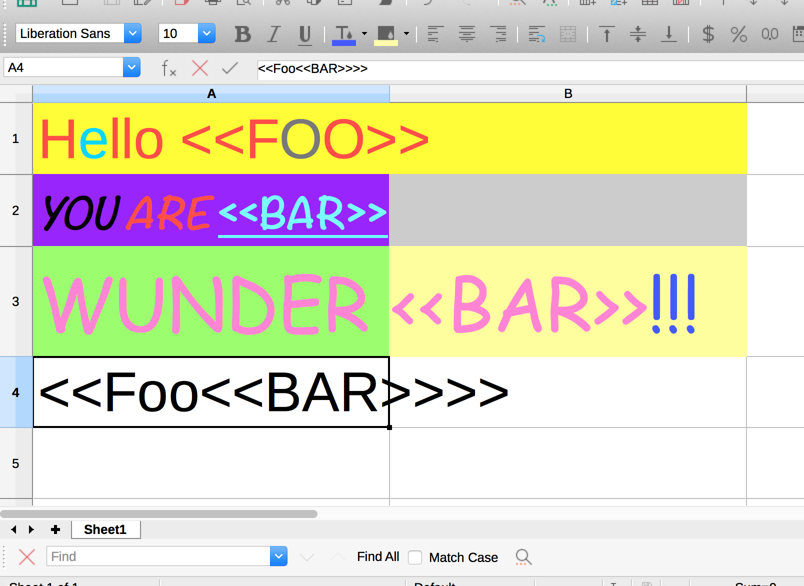
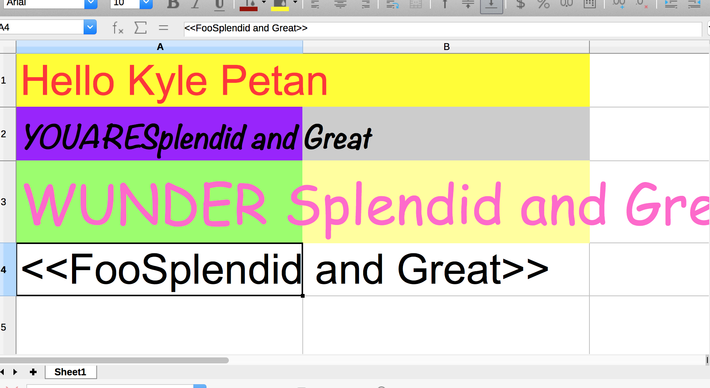

# Using openpyxl to look at cells in an excel spreadsheet.

## Styles do change in complicated situations.
- The style of first character of cell seems to win.

## nested merge symbols
- If needed maybe the regex needs to be smarter

## BUG OF THE DAY!!! 

One problem is that Libre Office spreadsheets fail to report row counts, and
column counts accurately...

so, this example does create a lot of extra cells. But, Excel saved spreadsheets reportedly report
accurate row and column counts enabling for an accuarte, efficient for-loop.

## Tip of the Day...

Use Openpyxl 2.2.6 to leave the styling intact while editing the text! Earlier
Versions fail to do so.
